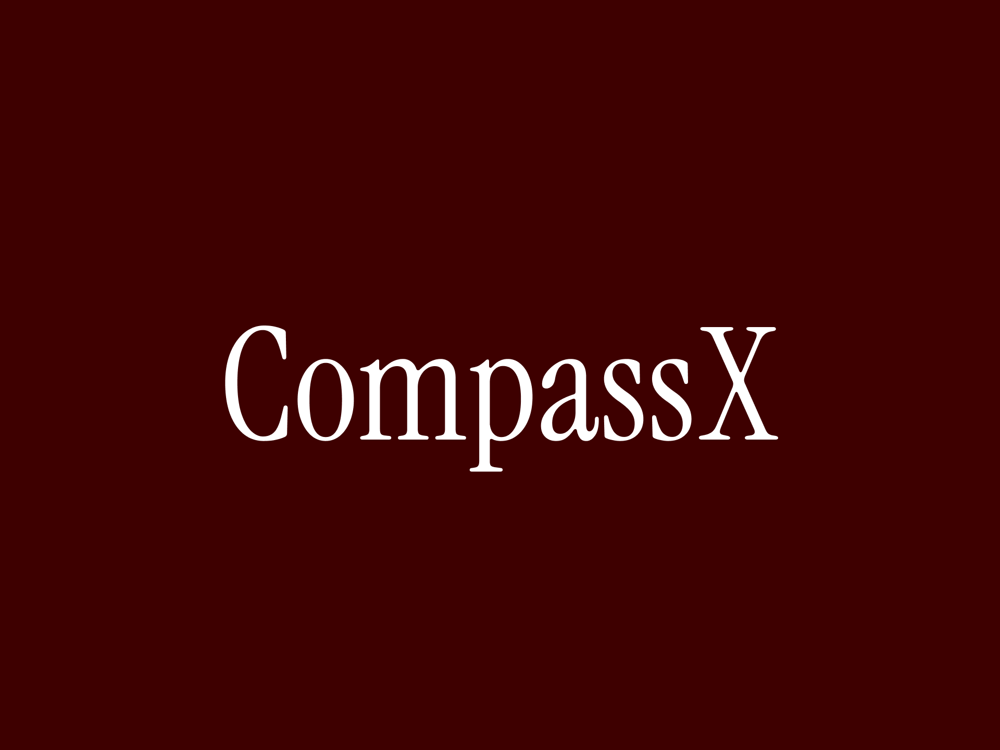

# CompassX



Provides reliable compass data and extensive documentation.

## Usage

```dart
StreamBuilder<CompassXEvent>(
  stream: CompassX.events,
  builder: (context, snapshot) {
    if (!snapshot.hasData) return const Text('No data');
    final compass = snapshot.data!;
    return Column(
      mainAxisSize: MainAxisSize.min,
      children: [
        Text('Heading: ${compass.heading}'),
        Text('Accuracy: ${compass.accuracy}'),
        Text('Should calibrate: ${compass.shouldCalibrate}'),
        Transform.rotate(
          angle: compass.heading * math.pi / 180,
          child: Icon(
            Icons.arrow_upward_rounded,
            size: MediaQuery.of(context).size.width - 80,
          ),
        ),
      ],
    );
  },
),
```

- `heading`: The heading relative to true north in degree.
- `accuracy`: The accuracy of the sensor data.
- `shouldCalibrate`: Whether the sensor should be calibrated or not.

## Install

Check the minimum supported version of your project and update as necessary.
- **iOS: 12**
- **Android: 21**

Request permission to get true heading in Android. Not required on iOS.
```console
$ flutter pub add permission_handler
```
Specify the permissions one or both of the following in AndroidManifest.xml.
It can be copied from [exmaple](https://github.com/natsuk4ze/compassx/blob/main/example/android/app/src/main/AndroidManifest.xml).
```xml
<uses-permission android:name="android.permission.ACCESS_COARSE_LOCATION" />
<uses-permission android:name="android.permission.ACCESS_FINE_LOCATION" />
```
- `ACCESS_COARSE_LOCATION`: Used when normal accuracy is required.
- `ACCESS_FINE_LOCATION`: Used when the highest quality accuracy is required.

Add code to request premissions.
```dart
if (!Platform.isAndroid) return;
await Permission.location.request();
```

## Precautions

When testing, use the actual device for testing. The emulator may not provide correct sensor data.  
**If you are going to use this plugin in your product apps, I strongly suggest you read [wiki](https://github.com/natsuk4ze/compassx/wiki) carefully**.  
More information about compasses in general and calibration in particular can be found on it.  
Please be sure to read the documentation before submitting an issue.
